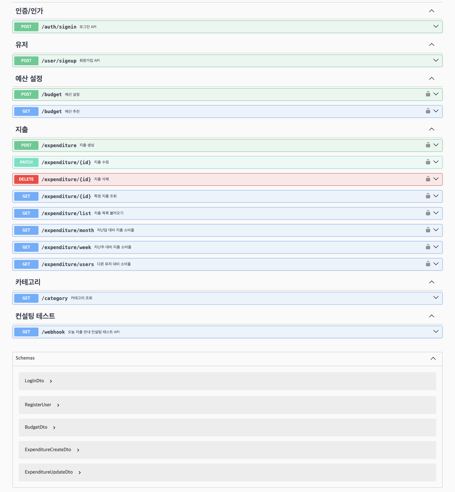
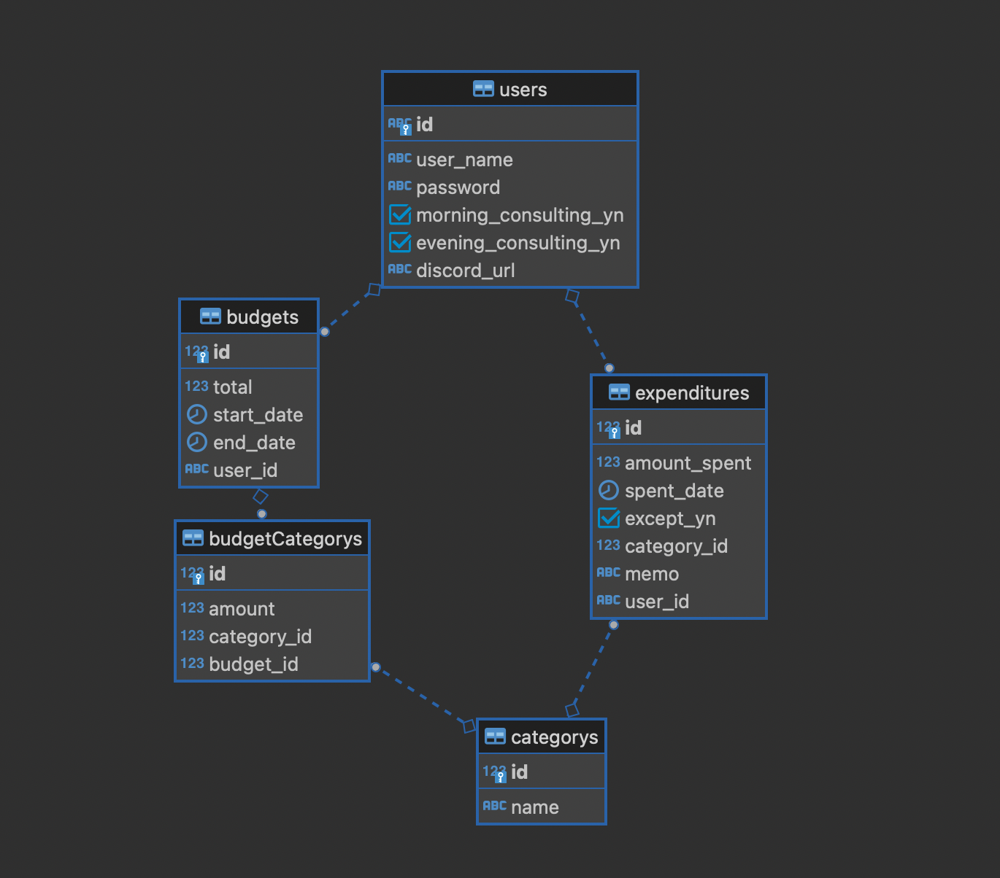
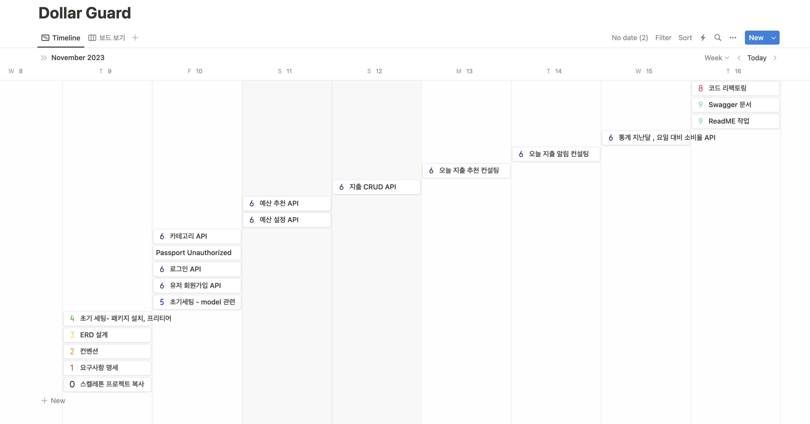
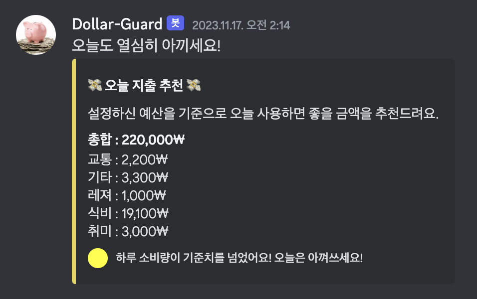
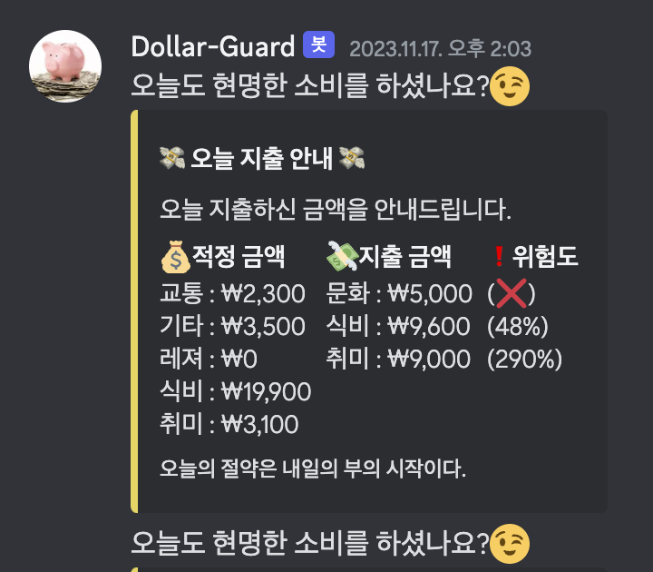

<div align="center">
    
</div>

# Dollar Guard

**사용할 예산을 설정하고 지출을 기록합니다.**
본 서비스는 사용자들이 개인 재무를 관리하고 지출을 추적하는 데 도움을 주는 애플리케이션입니다. 이 앱은 사용자들이 예산을 설정하고 지출을 모니터링하며 재무 목표를 달성하는 데 도움이 됩니다.

<br/>

## Table of Contents

- [개요](#개요)
- [API Reference](#api-reference)
- [ERD](#ERD)
- [프로젝트 진행 및 이슈 관리](#프로젝트-진행-및-이슈-관리)
- [구현과정(설계 및 의도)](<#구현과정(설계-및-의도)>)
- [TIL 및 회고](#til-및-회고)
- [Authors](#authors)

<br/>

## 개요

Dollar Guard는 개인 재정을 효과적으로 관리하고 지속 가능한 소비 습관을 형성할 수 있도록 도와주는 예산 관리 어플리케이션입니다.

사용자는 다양한 카테고리에 대한 예산을 설정하고 일정 기간 동안의 지출을 기록할 수 있습니다. 매일, 어플리케이션은 사용자의 설정된 예산과 실제 지출을 기반으로 오늘의 적절한 소비 추천 금액을 계산하여 제공합니다.
또한, Dollar Guard는 사용자의 소비량을 기반으로 다른 사용자들과의 비교를 제공하여 소비 습관을 평가하고 개선할 수 있는 통찰력을 제공합니다. 월간 리포트, 예산 초과 알림, 목표 설정 등 다양한 기능을 통해 사용자는 더 나은 재정 건강을 유지할 수 있습니다.

어플리케이션은 편리한 사용자 경험과 함께 안전한 데이터 보호를 제공하며, 커뮤니티 기능을 도입하여 사용자 간의 정보 공유와 소비 경험 공유를 촉진합니다.
<br/>

<br/>

## Skils

<div align="center">

언어 및 사용 도구 <br/>       
<br/>
데이터 베이스 <br/><br/>

</div>

<br/>

## Directory

<details>
<summary> 파일 구조 보기 </summary>

```
src
├── auth
│   ├── auth
│   ├── decorator
│   ├── dto
│   └── jwt.strategy
├── budget
│   ├── budget
│   ├── dto
│   ├── entities
│   └── pipe
├── category
│   ├── category
│   ├── entities
│   └── type
├── common
│   ├── customValidate.decorator
│   └── utils
├── config
│   └── typeorm.config
├── expenditure
│   ├── dto
│   ├── entities
│   ├── expenditure
│   └── pipe
├── user
│   ├── dto
│   ├── entities
│   ├── user
├── webhook
│   ├── discord.payload
│   ├── webhook
├── app.module
├── main
```

Nestjs의 특징을 살려 주요 기능들을 모듈화하여 분리하였습니다. API 기준 메인 기능들 위주로 분리하였고 각 모듈들 안에 Module, Controller, Service을 합쳐모듈 이름으로만 명시해놨습니다. 기능들 위주로 구조화한 이유는 추후 유지보수 측면에서 관리가 용이할 것이라고 판단하였고 DB의 쿼리문이 까다로운 모듈에서 Repository를 분리하였습니다. 유지보수를 하면서 Repository 패턴이 필요하다고 생각되는 모듈들을 리팩토링하여 분리할 계획입니다.

</details>
</br>

## API Reference

Swagger : http://localhost:{port}/swagger#/



<br/>

## ERD


<br/>

## 프로젝트 진행 및 이슈 관리

[프로젝트 관리 페이지](https://generated-cheddar-8e9.notion.site/49f6bd2d50e14ec68c04fc1467db0ae1?v=9bfd7fa954304527a341f58b4826095e&pvs=4)



<br/>

## 구현과정(설계 및 의도)

<details>
<summary>테이블 설계 고려사항 - click</summary>

- **유저**

  - 유저 테이블에는 기본적인 유저 정보와 컨설팅 서비스 동의 항목, discord_url이 있습니다.
    컨설팅 동의 컬럼이 true인 유저들만 스케쥴러를 통해 아침, 저녁 자동으로 실행되는 유저의 소비, 지출 관련 통계를 통한 컨설팅을 제공 받을 수 있으며 기입한 유저의 discord_url을 통해 디스코드 웹 훅으로 내용이 전달됩니다.

- **예산**

  - 유저가 설정한 예산의 전체적인 틀은 budgets 테이블에 저장됩니다. 설정한 예산의 자세한 내용(목록별 금액)은 budgetCategory 테이블에 저장이 됩니다. budgets 과 budgetCategory은 1:N 관계에 있습니다.

- **지출**

  - 예산 설정이 되어있지 않아도 유저는 지출을 기록할 수 있다고 판단하여 budgets와 관계되어 있지 않고 users에만 1:N 관계가 되어있습니다. 이 테이블을 통해 유저의 소비 기록을 조회하며 budgets의 예산 시작일, 종료일을 통해 예산별 소비 현황을 계산해 보여줍니다.

- **카테고리**
  - 예산 설정, 지출시 금액을 어떤 분야에 설정, 비출 할 것인지에 대한 목록입니다.

</details>

<details>
<summary>유저 API - click</summary>

- **회원가입**

  1. `계정`은 유저의 id를 기입

  - 계정 생성시 테이블에 Trigger로 유저의 id가 생성되며 [US + yyMMdd + 4자리의 일련번호] 형식으로 생성

  2. `비밀번호`는 아래와 같은 `제약 조건`을 가지며, `암호화`하여 데이터베이스에 저장

  - 비밀번호는 최소 10자 이상
  - 숫자, 문자, 특수문자 3가지를 포함해야합니다.

- **로그인**
  1. 계정, 비밀번호로 로그인 시 JWT토큰이 발급됩니다.
  2. 이후 게시물, 통계 API 요청 Header에 Access token가 항시 포함되며, JWT 유효성을 검증합니다.
  </details>

<details>
<summary>예산 설정 / 지출 API -click</summary>

- **예산 설정**

  1.  유저가 일정 기간동안 사용할 예산을 등록합니다.
  2.  예산 시작일, 예산 종료일, 카테고리별 예산 금액을 설정할 수 있습니다.
      ```
      시작일:'2023-11-01',
      종료일:'2023-11-30',
      목록별금액: {
        식비: 300000,
        취미: 100000,
        거주: 500000
      }
      ```
  3.  목록별 금액은 budgetCategory에 저장되며, 기간, 총 금액 등은 budgets에 저장됩니다.

- **예산 설정 자동**

  1.  카테고리 별 예산 설정에 어려움이 있는 사용자를 위해 예산 비율 추천 기능이 존재합니다.
  2. 총 금액과 기간만 설정시 추천 카테고리별 예산을안내합니다.
  3. 자동 생성된 예산은, 기존 이용중인 유저 들이 설정한 평균 값 입니다.

- **지출**
  1. 지출 관련 CRUD입니다. 지출이 발생했을 때 기록, 수정, 불러오기, 삭제 등을 할 수 있습니다.
  2. 지출은 기본적으로 지출한 금액, 지출 날짜, 지출한 카테고리(목록), 지출 내용, 합계 제외 입니다.
  3. 지출 목록을 한꺼번에 불러옵니다. 기간별로 조회 가능하며 지출 목록들과 지출 합계, 카테고리별 지출 합계 등의 내용도 불러옵니다. (합계 제외가 true인 지출은 목록은 불러오지만 합계 내용에 포함되지 않습니다.)

</details>

<details>
<summary>지출 컨설팅 - click</summary>

- **오늘 지출 추천**

  1. 매일 아침 8시, 사용자가 설정한 예산과 지출을 계산해 남은 예산 금액 대비 오늘 하루 지출하면 좋을 금액을 알려줍니다.
  2. 이 때, 남은 예산 기간, 남은 금액을 기반으로 잘 절약하고 있는지, 설정한 예산대비 지출이 많은지 등의 유저의 소비 습관의 위험도를 알려줍니다.
  3. 컨설팅 내용은 디스코드 웹훅으로 전송됩니다.
  4. 컨설팅 제공 기준은 users 테이블의 컬럼명 morning_consulting_yn이 true인지, discord_url이 있는지, 오늘 날짜 기준 유저가 설정한 예산 내용이 있는지 입니다.

  

- **오늘 지출 안내**

  1. 매일 저녁 8시, 오늘 지출한 내용을 총액 과 카테고리 별 금액을 알려줍니다.
  2. 남은 예산과 지출, 남은 금액을 토대로 오늘 유저가 소비했으면 좋았을 금액, 사용한 금액을 알려줍니다.
  3. 2번의 내용을 금액별, %지 별로 안내합니다. 또한 저축 관련 명언을 무작위로 전송합니다.
  4. 컨설팅 내용은 디스코드 웹훅으로 전송됩니다.
  5. 컨설팅 제공 기준은 users 테이블의 컬럼명 evening_consulting_yn이 true인지, discord_url이 있는지, 오늘 날짜 기준 유저가 설정한 예산 내용이 있는지 입니다.
     

</details>

<details>
<summary>지출 통계 API - click</summary>

- **지난달 대비 소비율**

  - 오늘 일자 기분 , 한달전의 소비량과 그 지난 한달의 소비량을 계산해 %로 알려줍니다.

- **일주일 전 대비 소비율**

  - 오늘 기준 요일(ex. 오늘 수요일)의 지출과 지난주 요일(ex. 저번주 수요일)의 소비량을 비교해 알려줍니다.

- **다른 유저 대비 소비율**

  - 오늘 기준 다른 유저들의 예산 대비 소비율 평균과 나의 소비율을 계산해 %로 알려줍니다.

</details>

<br/>

## TIL 및 회고

- [Passport Unauthorized!?]()
- [Custom Validator Decorator]()
- [authentication & authorization]()
- [QueryBuilder에 관하여]()
- [Custom Repository]()

<br/>

## Authors

<div align="center">

</br>

<a href="https://github.com/keeepmin94">유지민</a>

</div>
<br/>
